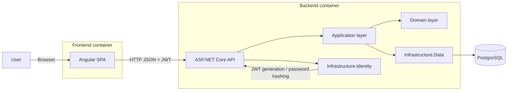

# C4: Container Diagram

This view shows the main runtime containers and the important internal boundaries that are
relevant for the code review.

## Notes

- `Domain` contains entities and invariants only.
- `Application` contains use cases, validation, DTOs, and interfaces.
- `Infrastructure.Data` implements repositories with raw SQL through `Npgsql`.
- `Infrastructure.Identity` implements password hashing and token generation.
- The API composes everything and exposes REST endpoints.
