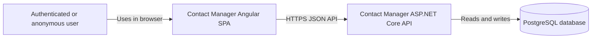

# C4: System Context

This view shows the product boundary and the external actor involved in the interview
exercise.

## Scope

- The user registers, logs in, and manages private contacts.
- The Angular SPA is the only user-facing client in this solution.
- The API owns authentication, authorization, validation, and business rules.
- PostgreSQL stores users, accounts, and contacts.
