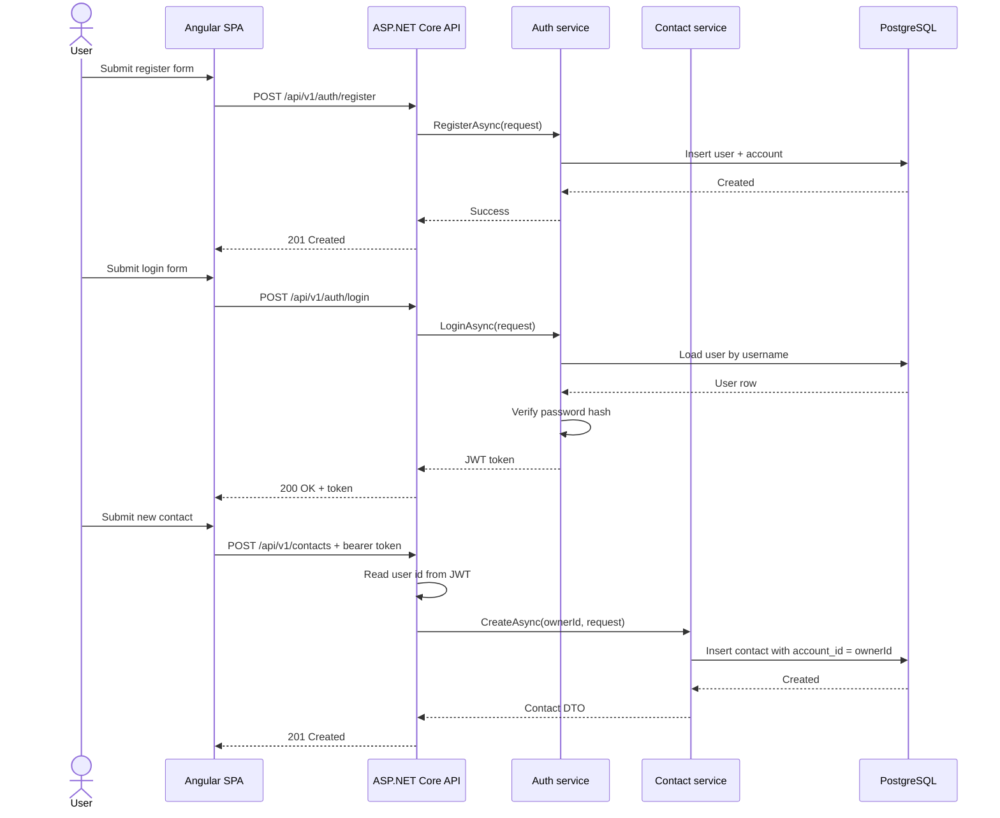

# Sequence: Register, Login, Create Contact

This sequence is useful in the interview because it shows the main happy path plus where
security decisions are enforced.

## Security point

The owner id used by contact operations comes from the JWT, not from the browser payload.
That is the control that prevents a caller from creating or manipulating data for another
user by tampering with requests.
